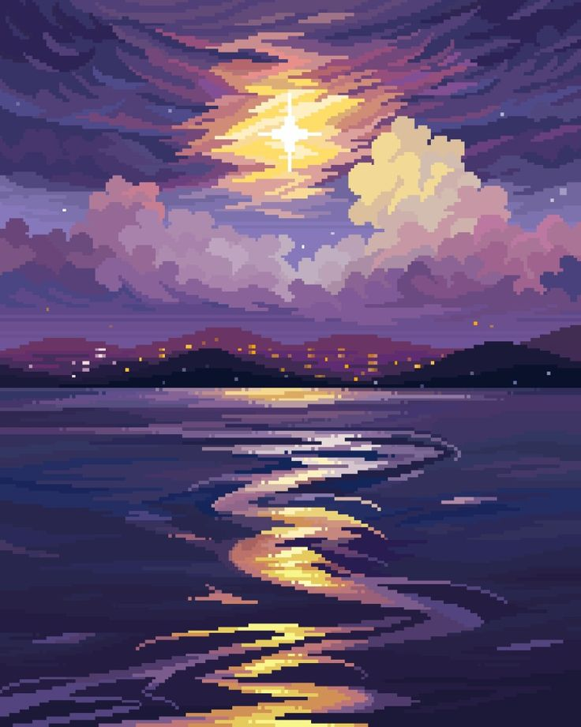
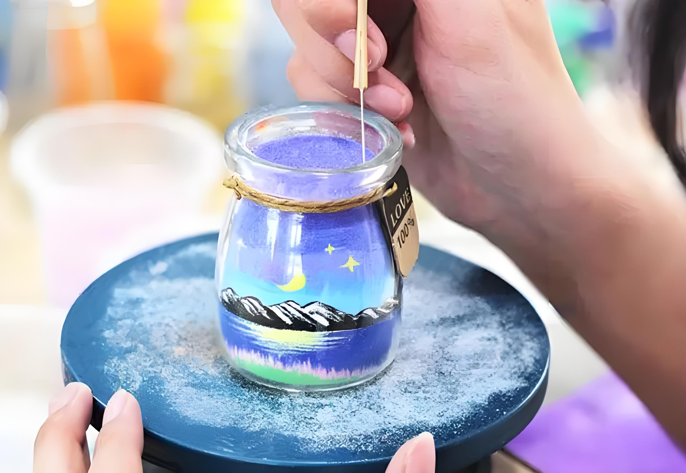

# byua0382_9103_tut08

## Part 1
The first piece of art that inspired me was the pixel style illustration, for the final project if our team choose a picture with more details, such as The scream, we can use the pixel style to render the picture in a way that has an abstract style, but still retains the beauty of the picture and is easier to realize.
The second one is a quicksand painting, where the author puts different colored sand layer by layer into a transparent bottle, and eventually the picture formed can be seen on the side. I wanted to use this same effect of falling sand, combined with a pixelated style, to realize our project.

## Part 2
It is feasible to use the grid in p5 to achieve this by constructing a 2D matrix and storing the contents of the grid where sand is present as 1, and the contents of the grid where it is not present as 0. The drop effect is achieved by setting the grid where the 1 are stored progressively downwards. It stops when it reaches the bottom. After that, each grid can be set to a different color to form a picture. By adding the mouse interaction mouseDragged, I can create the effect of mouse dragging to generate sand.

### Image 1

### Image 2

